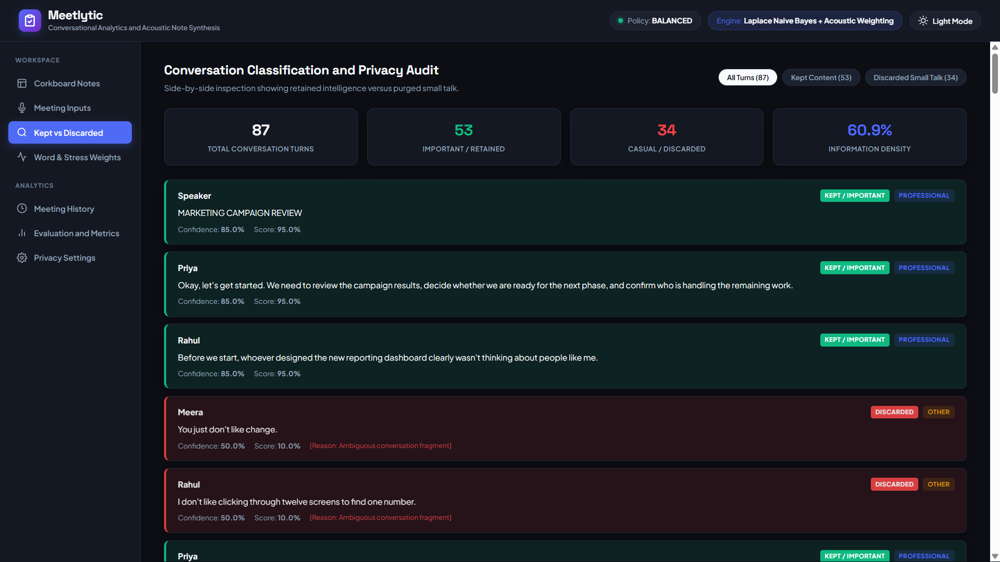

# Meetlytic: Privacy-First Meeting Intelligence & Structured Extraction Engine

Meetlytic is an edge-computing meeting intelligence platform that converts spoken discussions, raw transcripts, and audio recordings into verified business records, interactive sticky notes, and structured executive reports.

Built with a zero-retention privacy architecture, Meetlytic operates 100% offline without cloud APIs or external telemetry. Personal, casual, and non-work discussions are purged from RAM immediately with zero disk persistence.

---

## Catalog of Core Features

Meetlytic provides 20 distinct modular features across signal processing, privacy enforcement, semantic NLP, and web visualization:

### 1. 100% Offline Vosk Speech Recognition & Acoustic Processing
- Integrates offline Kaldi/Vosk speech recognition engine with local model caching.
- Direct 16 kHz 16-bit mono PCM decoding with word-level alignment and acoustic confidence scoring.
- Zero network dependencies: runs completely disconnected from cloud providers.

### 2. Multi-Layer Zero-Retention Privacy Architecture
- Maintains an in-RAM circular ring buffer that automatically overwrites stale audio data.
- Personal conversations, family chats, medical details, and informal small-talk are purged from memory via cryptographic zero-fills without touching persistent disk storage.

### 3. Configurable Tri-Mode Privacy Enforcement
- **BALANCED Mode (Default)**: Retains professional content meeting standard business confidence thresholds (>= 70%).
- **STRICT Mode**: Retains only unambiguous, high-confidence actionable directives (>= 85%).
- **CUSTOM Mode**: Permits user-defined numerical thresholds for specialized organizational or regulatory compliance requirements.

### 4. Advanced Speech-Act & Intent Relevance Gating
- Pre-classification relevance gate filters conversational filler, rhetorical questions, procedural remarks, and rants before semantic promotion.
- Distinguishes meaningful business intelligence from background noise, social greetings, and emotional venting.

### 5. Whole-Meeting Stateful Understanding & Conversation Continuity
- Multi-turn conversation state machine tracking context, participants, discourse goals, and open threads across long meetings.
- Resolves cross-turn contradictions, superseded estimates, and conversational corrections automatically.

### 6. Spoken Numeric & Currency Normalization Engine
- Converts spoken number words, compound scales, and currencies into clean numerical representations.
- Automatically transforms phrases such as "two hundred sixty three million dollars" to "$263 million", "forty six percent" to "46%", and "seventy point three percent" to "70.3%".

### 7. Atomic Proposition & Multi-Metric Fact Decomposition
- Decomposes compound, multi-clause run-on sentences into discrete, readable atomic facts.
- Formats extracted facts into normalized propositions: Entity + Property = Value + Time Context.
- Reconciles correlated values (e.g., 70.3% spent through month 10 -> Approximately 29.7% of budget remains; 2 months remaining in 12-month cycle).

### 8. Action Item Validation & Anaphora Object Resolution
- Enforces strict grammatical and semantic validation on action items: requires concrete action verbs, non-vague target objects, and owner assignment.
- Discards unanchored commands and pronoun-only phrases (e.g., "Rahul, do it" or "Handle that") unless the antecedent object is unambiguously resolved from preceding turns.

### 9. Consensus Decision vs. Opinion Boundary Enforcement
- Strictly separates individual opinions, preferences, and proposals ("I think we should switch to PostgreSQL") from ratified group decisions.
- Promotes decisions only upon detection of explicit consensus markers, leadership ratifications, or formal vote confirmations.

### 10. Task Dependency & Blocker Chain Tracking
- Identifies causal dependencies and execution blockers across speakers (e.g., "Task B cannot proceed until Task A is deployed").
- Maps blocker conditions to owning owners and resolution states.

### 11. Speaker Diarization & Entity Resolution
- Maps raw transcript speaker identifiers (e.g., "SPEAKER_01", "Speaker A", "John D.") to normalized participant profiles.
- Resolves first-name references and conversational vocatives to assigned team members.

### 12. Temporal Anchor & Milestone Resolution
- Resolves relative temporal markers ("by next Friday", "end of Q3", "in two weeks") into explicit milestone records and deadline trackers.

### 13. Dynamic Topic Modeling & Canonical Normalization
- Extracts key discussion topics using TF-IDF term weighting and semantic clustering.
- Strips conversational metadata and confirmation tokens ("Confirmed", "Checked", "Estimate") to produce canonical, domain-independent topic titles.

### 14. Visual Corkboard Sticky-Notes Dashboard
- Real-time responsive Web GUI that maps extracted meeting intelligence to visual sticky notes.
- Color-coded categories: Gold for Decisions, Blue for Action Items, Red for Blockers/Risks, Green for Current Metrics, and Purple for Deadlines.

### 15. Participant Workload & Accountability Profiling
- Generates per-participant workload cards showing turn distribution, focus areas, and assigned action items.

### 16. Multi-Source Audio & Transcript Input Pipeline
- Supports three ingestion modes:
  1. Live microphone stream via standard PC soundcard.
  2. Batch audio file upload (.wav, .mp3, .m4a, .ogg, .flac) via web dashboard.
  3. Direct multi-speaker transcript paste into web or CLI simulator.

### 17. Hardware Table Node Streaming via ESP8266 & I2S MEMS Mic
- Firmware and hardware bridge for standalone ESP8266 / NodeMCU micro-controllers with INMP441 I2S digital MEMS microphones.
- Streams 16 kHz 16-bit PCM audio chunks over local WiFi TCP sockets directly to the Meetlytic engine.

### 18. Mathematical First-Principles Fallback Subsystems
- Contains standalone, pure Python/NumPy implementations of:
  - 13-coefficient Mel-Frequency Cepstral Coefficients (MFCC).
  - Dynamic Time Warping (DTW) with Sakoe-Chiba band constraints for acoustic keyword spotting.
  - Multinomial Naive Bayes classifier with Laplace smoothing.
  - Voice Activity Detection (VAD) using Short-Time Energy, Zero-Crossing Rate, and Spectral Flatness.

### 19. SQLite Meeting Record Persistence & Clean Schema
- ACID-compliant local storage using SQLite (`web_meeting_records.db` / `meeting_records.db`).
- Stores sanitized professional transcripts, structured action items, decisions, and privacy audit metrics with zero cloud exposure.

---

## User Interface Showcase

Meetlytic features a responsive, dark-mode and light-mode web dashboard designed for real-time meeting transcription, visual sticky-note synthesis, statement-level classification audit, and quantitative NLP model benchmarking:

### 1. Meeting Input & Multi-Source Audio Ingestion Panel
Supports live microphone streaming, WAV/MP3/M4A/FLAC file uploads, direct multi-speaker transcript pasting, and tri-mode privacy policy configuration (BALANCED, STRICT, CUSTOM).


### 2. Interactive Corkboard & Sticky Notes Synthesis
Transforms raw meeting discourse into actionable sticky notes organized into Decisions (Gold), Action Items (Blue), Risks & Blockers (Red), Current Metrics (Green), and Temporal Deadlines (Purple).


### 3. Kept vs. Discarded Privacy Filtering Audit
Provides a statement-by-statement transparency ledger showing exact classification decisions, confidence scores, and reasons for purging casual small-talk, sarcasm, badmouthing, and emotional venting.



### 4. Quantitative NLP Performance & Benchmark Evaluation
Evaluates overall accuracy, macro-averaged F1 scores, turn latency, zero-retention privacy compliance rates, ROUGE n-gram overlap, and BLEU generation precision against gold-standard meeting notes.


---

## System Pipeline Architecture

```
                    AUDIO / TRANSCRIPT INPUT
         (Local Mic / File Upload / ESP8266 WiFi / Raw Text)
                                |
                                v
               [1] OFFLINE SPEECH RECOGNITION (VOSK)
           (16 kHz Mono PCM Decoding + Word Alignment)
                                |
                                v
                [2] TEXT SANITIZER & DIARIZER
           (Speaker Resolution + Metadata Stripping)
                                |
                                v
                 [3] PRIVACY & RELEVANCE GATE
    (Zero-Retention RAM Purge of Casual / Gossip / Venting)
                                |
                                v
               [4] INTENT & SPEECH-ACT CLASSIFIER
       (Laplace-Smoothed Naive Bayes + Rule-Based Scoring)
                                |
                                v
              [5] STATEFUL CONVERSATION ENGINE
     (Multi-Turn Context Graph + Contradiction Resolution)
                                |
                                v
           [6] ATOMIC PROPOSITION FACT DECOMPOSER
         (Spoken Number Normalization + Value Gating)
                                |
                                v
          [7] PERSISTENCE & EXECUTIVE REPORT ENGINE
   (SQLite Storage + Sticky Notes Generation + Audit Metrics)
                                |
                                v
                      USER PRESENTATION
     (Web Corkboard UI / Console Dashboard / Terminal Reports)
```

---

## Directory Structure

```
.
|-- .gitignore                  # Git ignore definitions
|-- README.md                   # Complete system documentation
|-- requirements.txt            # Python dependencies
|-- app.py                      # Flask Web Application & REST API
|-- main.py                     # CLI Real-Time Meeting Engine
|-- demo_mode.py                # Standalone Interactive Simulator
|-- audio/                      # Audio capture, VAD, ring buffer, Vosk ASR
|   |-- __init__.py
|   |-- buffer.py               # In-RAM circular audio buffer with zero-wipe
|   |-- capture.py              # SoundDevice microphone capture interface
|   |-- segmenter.py            # Speech turn segmenter with hangover logic
|   |-- transcriber.py          # Offline Vosk speech recognition engine
|   \-- vad.py                  # Energy, ZCR, and spectral flatness VAD
|-- config/                     # Lexicons, system settings, trained models
|   |-- __init__.py
|   |-- settings.py             # System constants and thresholds
|   |-- trained_model.json      # Pre-trained Naive Bayes probability tables
|   \-- vocabulary.py           # Domain lexicons and keyword weights
|-- display/                    # Console UI and ANSI terminal rendering
|   |-- __init__.py
|   \-- console_ui.py           # Terminal dashboard interface
|-- hardware/                   # ESP8266 hardware firmware and documentation
|   |-- __init__.py
|   |-- esp8266_firmware.ino    # Arduino C++ firmware for NodeMCU
|   |-- wifi_bridge.py          # TCP socket receiver for WiFi audio stream
|   \-- wiring.md               # Electrical wiring schematic and pinout
|-- nlp/                        # Natural Language Processing & State Engine
|   |-- __init__.py
|   |-- classifier.py           # Multinomial Naive Bayes classifier
|   |-- context.py              # Context window boost calculator
|   |-- context_graph.py        # Discourse graph builder
|   |-- diarization.py          # Speaker entity resolver
|   |-- discourse.py            # Discourse markers and turn transition logic
|   |-- evidence_validator.py   # Semantic quality and ASR noise validator
|   |-- extractor.py            # Rule-based business entity extractor
|   |-- intelligence_types.py   # Dataclass definitions for meeting items
|   |-- intent_filter.py        # Intent classification and speech-act routing
|   |-- parser_engine.py        # Parsing routines for raw dialogue
|   |-- relevance_gate.py       # Gatekeeper filtering non-meeting chatter
|   |-- roster.py               # Participant roster management
|   |-- sanitizer.py            # Transcript normalization and tag cleaner
|   |-- schema_validator.py     # Structural validation for output items
|   |-- semantic_state.py       # Semantic state representations
|   |-- stateful_engine.py      # Whole-meeting state machine and proposition engine
|   |-- sticky_notes.py         # Visual sticky note generator
|   |-- synthesizer.py          # Summary synthesizer
|   |-- temporal.py             # Date, deadline, and timeframe parser
|   |-- tfidf.py                # Pure Python TF-IDF implementation
|   |-- tokenizer.py            # Regex tokenizer and rule-based stemmer
|   |-- topic_modeler.py        # Topic clustering and canonical title generator
|   \-- transcript_quality.py   # Text coherence and noise metrics
|-- privacy/                    # Privacy filtering and zero-retention policies
|   |-- __init__.py
|   |-- filter.py               # Zero-retention memory filter implementation
|   \-- modes.py                # Privacy policy modes (STRICT, BALANCED, CUSTOM)
|-- speaker/                    # Speaker acoustic profiling
|   |-- __init__.py
|   \-- identifier.py           # Acoustic feature extraction and speaker matching
|-- speech/                     # Keyword spotting and acoustic matching
|   |-- __init__.py
|   |-- dtw.py                  # Dynamic Time Warping with Sakoe-Chiba band
|   |-- features.py             # 13-coefficient MFCC feature extractor
|   |-- keyword_spotter.py      # Template-matching keyword spotter
|   \-- templates/              # Enrolled audio templates
|       \-- README.md
|-- static/                     # Web dashboard assets
|   |-- css/
|   |   \-- style.css           # Modern corkboard stylesheet
|   \-- js/
|       \-- app.js              # Dashboard client logic and API interactions
|-- storage/                    # SQLite persistence and reporting
|   |-- __init__.py
|   |-- database.py             # SQLite database layer with schema migrations
|   \-- summary.py              # Executive report generator
|-- templates/                  # Web dashboard HTML
|   \-- index.html              # Single-page web interface
\-- tools/                      # CLI utilities
    |-- __init__.py
    |-- record_template.py      # Keyword audio enrollment tool
    \-- train_classifier.py     # Custom Naive Bayes training utility
```

---

## Mathematical & Algorithmic Foundations

Meetlytic includes first-principles implementations of signal processing and natural language algorithms:

### 1. Voice Activity Detection (VAD)
The VAD module evaluates each 30ms frame using a multi-feature decision boundary:
- **Short-Time Energy (STE)**:
  `E = sum(x[n]^2) / N`
- **Zero-Crossing Rate (ZCR)**:
  `ZCR = sum(|sgn(x[n]) - sgn(x[n-1])|) / (2N)`
- **Spectral Flatness Measure (SFM)**:
  Ratio of geometric mean of power spectrum to arithmetic mean.

### 2. Mel-Frequency Cepstral Coefficients (MFCC)
Acoustic feature extraction follows standard physical speech synthesis modeling:
1. **Pre-emphasis**: `y[n] = x[n] - 0.97 * x[n-1]`
2. **Hamming Windowing**: `w[n] = 0.54 - 0.46 * cos(2 * pi * n / (N - 1))`
3. **Discrete Fourier Transform (FFT)**: 512-point magnitude spectrum.
4. **Mel Filterbank**: 26 triangular bandpass filters spaced linearly below 1 kHz and logarithmically above 1 kHz.
5. **Log Energy & Discrete Cosine Transform (DCT)**: Retains first 13 cepstral coefficients.

### 3. Dynamic Time Warping (DTW)
Keyword spotting compares query MFCC sequences `Q = (q_1, ..., q_N)` with enrolled template `T = (t_1, ..., t_M)`:
- Distance metric: Euclidean distance `d(q_i, t_j) = ||q_i - t_j||_2`.
- Cumulative cost matrix:
  `D(i, j) = d(q_i, t_j) + min(D(i-1, j), D(i, j-1), D(i-1, j-1))`
- Global path constraint: Sakoe-Chiba band constraint `|i - j| <= R` to prevent non-linear acoustic warping.

### 4. Laplace-Smoothed Multinomial Naive Bayes
Text classification estimates posterior class probability `P(C_k | W)` for classes `{professional, personal, casual}`:
- `log P(C_k | W) = log P(C_k) + sum_i log P(w_i | C_k)`
- With Laplace (add-1) smoothing:
  `P(w_i | C_k) = (count(w_i, C_k) + 1) / (sum_w count(w, C_k) + |V|)`

---

## Installation & Setup

### 1. Prerequisites
- Python 3.9, 3.10, 3.11, or 3.12
- Standard audio input device (for live microphone mode)

### 2. Clone and Install Dependencies

```bash
git clone https://github.com/your-username/meetlytic.git
cd meetlytic
pip install -r requirements.txt
```

---

## Usage Guide

### Option 1: Web GUI Application (Recommended)

Launch the Flask web server:

```bash
python app.py
```

Open your web browser and navigate to:
```
http://localhost:5000
```

Features available in the Web UI:
- **Transcript Analyzer**: Paste multi-speaker meeting transcripts to extract structured intelligence and sticky notes.
- **Audio File Upload**: Upload `.wav`, `.mp3`, `.m4a`, or `.ogg` audio files for automated offline transcription and analysis.
- **Privacy Audit Log**: Real-time breakdown of analyzed turns, discarded casual talk, retained business intelligence, and sanitization verification.
- **Visual Corkboard**: Interactive sticky notes organized by semantic category.
- **Meeting Records History**: View past meeting summaries stored in the local SQLite database.

### Option 2: CLI Real-Time Meeting Engine

Start real-time audio capture and live terminal dashboard using your computer microphone:

```bash
python main.py --mode BALANCED
```

Available CLI arguments:
- `--mode [STRICT|BALANCED|CUSTOM]`: Set privacy enforcement threshold (default: `BALANCED`).
- `--wifi-esp`: Enable TCP socket server to accept streaming audio from an ESP8266 table node.
- `--demo`: Launch interactive demo simulator.
- `--record-template`: Enroll custom spoken keywords.
- `--train`: Retrain the Naive Bayes classifier on custom data.

### Option 3: Interactive Demo & Script Simulator

Test Meetlytic with pre-packaged or custom meeting scripts without a microphone:

```bash
python demo_mode.py
```

Menu options:
1. Paste multi-line meeting transcript.
2. Type sentences interactively turn-by-turn.
3. Run built-in realistic mixed meeting simulation (15 turns).
4. Change privacy mode.
5. View latest meeting summary from database.
6. Exit demo.

### Option 4: Keyword Enrollment & Training Tools

To enroll spoken keyword audio templates:
```bash
python -m tools.record_template
```

To retrain the Naive Bayes classifier:
```bash
python -m tools.train_classifier
```

---

## REST API Reference

Meetlytic provides RESTful HTTP endpoints for integration into existing workflows:

### 1. Analyze Transcript
- **URL**: `/api/analyze`
- **Method**: `POST`
- **Content-Type**: `application/json`
- **Request Body**:
```json
{
  "text": "Lead: The database migration has been completed.\nRahul: I will deploy the API gateway by 5 PM.\nManager: Approved, let's target Friday for beta release.",
  "privacy_mode": "BALANCED"
}
```
- **Response**:
```json
{
  "meeting_id": 1,
  "total_sentences": 3,
  "results": [...],
  "speaker_profiles": [...],
  "sticky_notes": [
    {
      "category": "DECISIONS",
      "text": "Target Friday for beta release",
      "color": "gold"
    },
    {
      "category": "ACTIONS",
      "text": "Deploy the API gateway by 5 PM",
      "owner": "Rahul",
      "color": "blue"
    },
    {
      "category": "FACTS",
      "text": "Database migration is completed",
      "color": "green"
    }
  ],
  "summary": "...",
  "stats": {
    "total_segments_processed": 3,
    "professional_segments_retained": 3,
    "private_segments_discarded": 0,
    "retention_rate": 1.0,
    "privacy_mode": "BALANCED"
  }
}
```

### 2. Audio File Upload & Transcription
- **URL**: `/api/upload-audio`
- **Method**: `POST`
- **Content-Type**: `multipart/form-data`
- **Form Data**:
  - `audio`: Audio binary file (`.wav`, `.mp3`, `.m4a`, `.ogg`)
  - `privacy_mode`: `BALANCED` / `STRICT` / `CUSTOM`
- **Response**: Full JSON meeting intelligence analysis with transcription payload.

### 3. Retrieve Meeting History
- **URL**: `/api/records`
- **Method**: `GET`
- **Response**:
```json
{
  "meetings": [
    {
      "id": 1,
      "session_name": "Meetlytic Transcript Analysis",
      "start_time": "2026-09-01 21:00:00",
      "privacy_mode": "BALANCED",
      "status": "COMPLETED"
    }
  ]
}
```

---

## Hardware Node Setup (ESP8266 + INMP441)

For physical conference room deployment, Meetlytic supports an external WiFi microphone node built on the ESP8266 micro-controller:

### Bill of Materials
1. ESP8266 NodeMCU v2 or v3 (~$4)
2. INMP441 I2S Digital MEMS Microphone (~$3)
3. SSD1306 0.96" I2C OLED Display (~$3)
4. Common-Cathode RGB LED + Resistors (220 Ohm, 330 Ohm) (~$1)
5. Breadboard and Jumper Wires (~$3)

### Wiring Pinout

| Component | Pin | ESP8266 GPIO / Pin | Note |
| :--- | :--- | :--- | :--- |
| **INMP441** | `VDD` | `3V3` | 3.3V Power |
| | `GND` | `GND` | System Ground |
| | `SD` (Data) | `GPIO 13 (D7)` | I2S Serial Data |
| | `SCK` (Clock)| `GPIO 14 (D5)` | I2S Bit Clock |
| | `WS` (Word) | `GPIO 15 (D8)` | I2S LR Clock |
| | `L/R` (Sel) | `GND` | Left Channel |
| **SSD1306 OLED** | `VCC` | `3V3` | 3.3V Power |
| | `GND` | `GND` | System Ground |
| | `SDA` | `GPIO 4 (D2)` | I2C Data |
| | `SCL` | `GPIO 5 (D1)` | I2C Clock |
| **RGB LED** | `Red` | `GPIO 16 (D0)` | 330 Ohm Resistor |
| | `Green` | `GPIO 12 (D6)` | 220 Ohm Resistor |
| | `Blue` | `GPIO 2 (D4)` | 220 Ohm Resistor |
| | `Cathode` | `GND` | System Ground |

### Flashing Firmware
1. Open `hardware/esp8266_firmware.ino` in Arduino IDE.
2. Install the `ESP8266` board package and `Adafruit SSD1306` library.
3. Configure your local WiFi SSID and password in the firmware.
4. Set the target server IP address to your computer running Meetlytic.
5. Flash the sketch to the NodeMCU.
6. Run `python main.py --wifi-esp` on your computer to start receiving the audio stream.

---

## Privacy & Security Guarantees

1. **Zero-Retention Memory Hygiene**: Non-work speech turns are purged from memory buffers immediately following classification.
2. **Local Processing**: Audio transcription and NLP extraction execute locally on the host machine.
3. **No External Network Requests**: The application operates without contacting external servers, tracking endpoints, or cloud analytics services.
4. **Verifiable Audit Logging**: The application computes privacy metrics on each session (segments analyzed, casual/gossip/venting discarded, professional items retained) for transparent auditing.

---

## License

This project is licensed under the MIT License.
